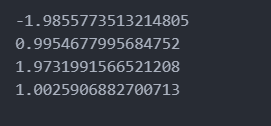

# Bayesian-Classification-with-Gaussian-Distributions    
## Intro to Probabilistic AI Models:   
**Bayesian Classification** is a probabilistic model based on Bayes’ Theorem.
It predicts class membership by calculating the posterior probability of each class.
This method is widely used for its simplicity, efficiency.  
## objects:   
- Simulate data from two different normal distributions representing two classes.    
- Estimate the likelihoods and priors.    
- Build and evaluate a Bayes classifier that assigns each point to the most probable class using Bayes' theorem.    
- Measure the model’s performance on test data.     
### Step 1: Simulate Two Gaussian Distributions       
We first generate two sets of data:   
- Class 1 (X1) with mean = -2 and standard deviation (ecart) = 1     
- Class 2 (X2) with mean = 2 and standard deviation = 1     
We generate:   
- 10,000 samples from X1    
- 20,000 samples from X2    
```
import numpy as np
import matplotlib.pyplot as plt
     
mu1, sigma1 = -2, 1
mu2, sigma2 = 2, 1
   
X1 = np.random.normal(mu1, sigma1, 10000)  
X2 = np.random.normal(mu2, sigma2, 20000)
print(X1)
print(X2)
print("X1 mean: ", np.mean(X1))
print("X1 std: ", np.std(X1))
print("X2 mean: ", np.mean(X2))
print("X2 std: ", np.std(X2))  
```
<p align="center">    
          
</p>
    
     
### Step 2: Build the Dataset with Class Labels    
Each sample is labeled:   
-  creates an array y1 containing 10,000 elements, all set to 1.
-  creates an array y2 with 20,000 elements, all set to 0.
-  merges two datasets X1 and X2 into a single dataset X.
-  combines the two label arrays into a single label array y.
-  Generates a random permutation of the indices from 0 to len(X)-1.
-  Rearranges the dataset X according to the random indices from the previous step.
-  shuffles the labels in the same way as the data(in order to each data sample still keeps its correct label (0 or 1))
      
```
y1 = np.ones(10000)
y2 = np.zeros(20000)
     
X = np.concatenate([X1, X2])
y = np.concatenate([y1, y2])

indices = np.random.permutation(len(X))   
X = X[indices]
y = y[indices]
print(X)
print(Y)
```
<p align="center">    
          
</p>    
           
### Step 3: Split the Dataset into Training and Test Sets    
We use 50% of the data for training, and 50% for testing:   
- X_train : training data (50%)    
- X_test : test data (50%)         
- y_train :  training labels     
- y_test : test labels    

```   
from sklearn.model_selection import train_test_split   

X_train, X_test, y_train, y_test = train_test_split(X, y, test_size=0.5, random_state=42)
print(X_train)
print(X_test)
print(Y_train)
print(Y_test)  
```
<p align="center">    
          
</p>    
    
### Step 4: Estimate the Likelihoods    
Assuming Gaussian distribution, we estimate:   
-  selects all training samples where the label is 1
-  selects all training samples with label 0
-  compute the mean and std for class 1(mu_1,sigma_1).   
-  Same for class 0.
**Likelihood** means the chance or probability that something will happen.

```
X_train_1 = X_train[y_train == 1]   
X_train_0 = X_train[y_train == 0]   
   
mu_1 = np.mean(X_train_1)   
sigma_1 = np.std(X_train_1)   
   
mu_0 = np.mean(X_train_0)   
sigma_0 = np.std(X_train_0)
print(mu_1)
print(sigma_1)
print(mu_2)
print(sigma_2)
```
<p align="center">    
          
</p>     
       
### Step 5: Estimate Prior Probabilities P(Y=1) and P(Y=0):  
we are calculating the prior probabilities of each class (P(y=1) and P(y=0)), which are essential in **Bayes’ theorem**.    

```
P_y1 = len(X_train_1) / len(X_train)    
P_y0 = len(X_train_0) / len(X_train)
print(p_y0)
print(p_y1)    
```
<p align="center">    
          
</p>   
    
### step 6:Define the bayes classifier:   
Now we define a function that applies Bayes’ rule for classification.   
It calculates posterior probabilities using the Gaussian likelihoods and priors.     
**To predict if a new input x belongs to class 1 or class 0, based on Bayes’ theorem and the assumption that each class follows a normal (Gaussian) distribution.**  

```
from scipy.stats import norm

def bayes_classifier(x):
     
    p_x_given_y1 = norm.pdf(x, mu_1, sigma_1)
    p_x_given_y0 = norm.pdf(x, mu_0, sigma_0)
   
    posterior_y1 = p_x_given_y1 * P_y1
    posterior_y0 = p_x_given_y0 * P_y0
   
    return 1 if posterior_y1 > posterior_y0 else 0
```

### Step 7: Predict on Test Set and Evaluate Accuracy   
We classify all test points and compare with true labels:
- applies your bayes_classifier function to each element x in X_test
- import the accuracy_score function from scikit-learn(compares two label arrays: the true labels and the predicted labels).
- computes the accuracy:
    - y_test: the actual test labels (ground truth)
    - y_pred: the predicted labels from your classifier

```
y_pred = np.array([bayes_classifier(x) for x in X_test])
print(Y_pred)
print(Y_pred.shape)     
        
from sklearn.metrics import accuracy_score   
accuracy = accuracy_score(y_test, y_pred)   
print("Précision du classifieur de Bayes :", accuracy)   
```
<p align="center">    
      
     
</p>


 


   


